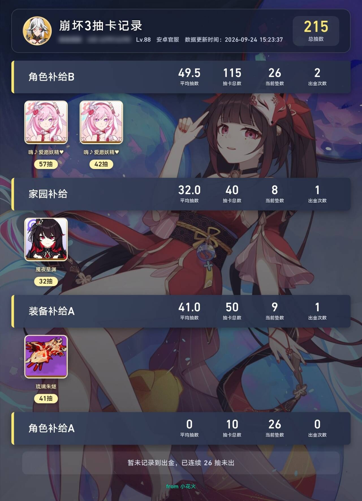
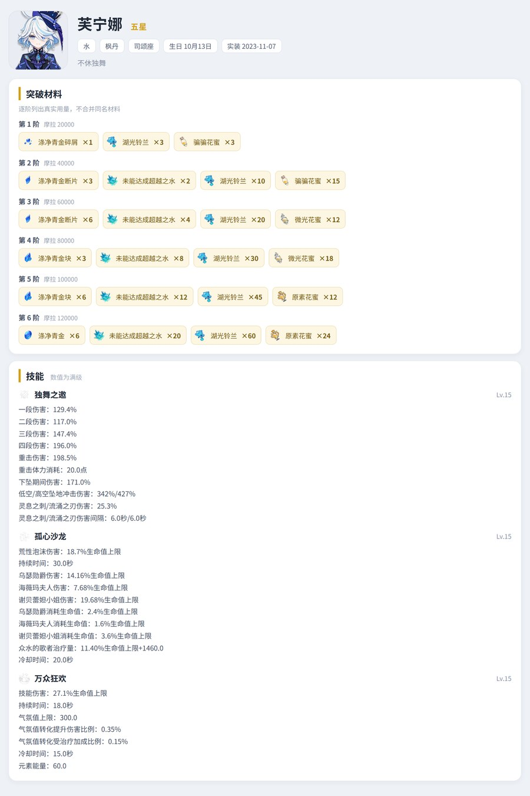
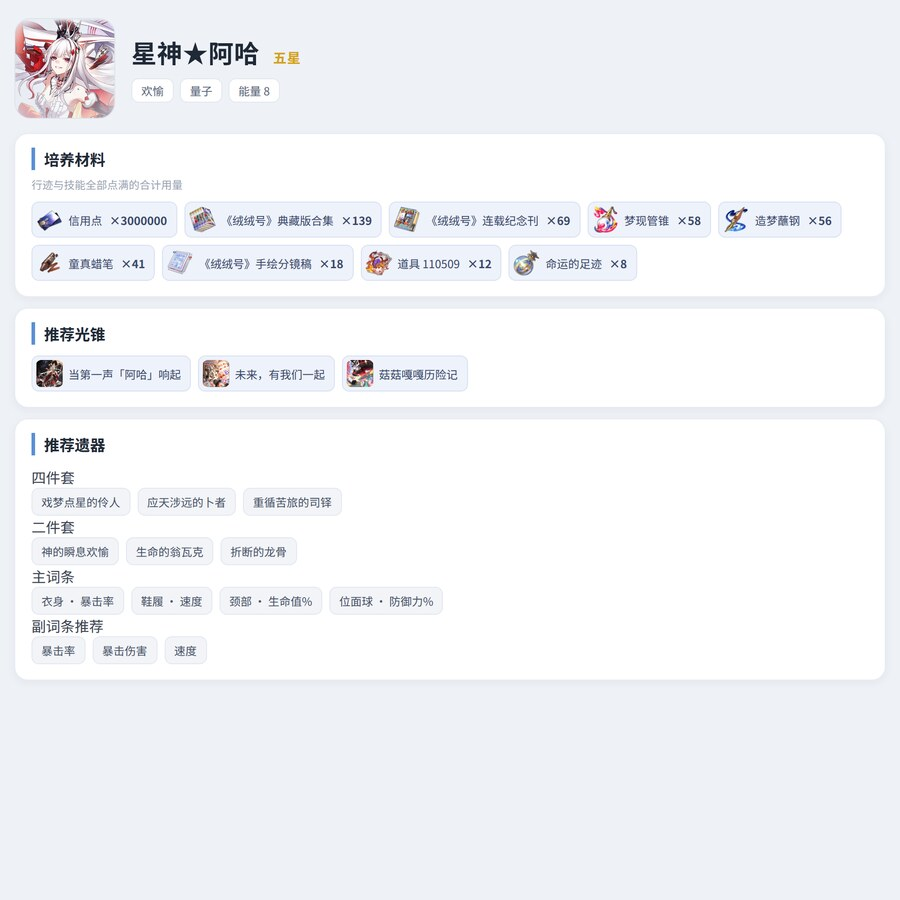

# 小花火 xhh · 米游社四游戏助手

<div align="center">

[](https://github.com/YUYUYUYU2147/Yunzai)
[](#)
[](https://nodejs.org)
[](LICENSE)
[](#重要说明)

</div>

<div align="center">

<p></p>

</div>

> **原神 / 崩坏：星穹铁道 / 绝区零 / 崩坏3** 的体力、卡池、签到、图鉴、攻略、角色语音，一条指令出图。
> 卡池数据**自动同步米游社官方公告与 BWiki**，不需要你手动维护；
> 原神与星铁的图鉴数据取自 nanoka.cc，查询更快且不需要米游社 Cookie。

<div align="center">

| 四游戏体力聚合 | 卡池 / 复刻统计 | 崩三全功能 | 自动签到 + 推送 |
| :---: | :---: | :---: | :---: |
| `#全体力` | `#原神卡池` | `#崩三深渊` | `#原神自动签到` |
| `#原神体力` | `#崩三补给` | `#崩三战场` | `#原神体力推送 130` |
| `#星铁体力` | `#星铁复刻统计` | `#崩三乐土` | `#崩三体力推送` |
| `#绝区零体力` | `#绝区零卡池` | `#崩三水晶` | `#开启自动米游币` |

</div>

---

## 30 秒上手

```bash
# 在云崽根目录执行
git clone -b v2 https://github.com/YUYUYUYU2147/xhh.git ./plugins/xhh/
cd ./plugins/xhh && pnpm i
```
重启云崽 → 群里发 `#小花火帮助` 就能看到全部指令。

<details>
<summary><b>其它安装方式（换源 / 加速前缀 / 切分支 / 更新）</b></summary>

```bash
# GitHub 访问慢时用加速前缀（换成你可用的加速地址）
git clone -b v2 <加速前缀>https://github.com/YUYUYUYU2147/xhh.git ./plugins/xhh/

# 已安装：换源
cd plugins/xhh
git remote set-url origin https://github.com/YUYUYUYU2147/xhh.git

# 更新
git fetch origin && git checkout -B v2 origin/v2 && git pull && pnpm i
```
</details>

---

## 目录

| 章节 | 说明 |
| --- | --- |
| [30 秒上手](#30-秒上手) | clone + 安装 + 重启 |
| [它能做什么](#它能做什么) | 六大功能模块，配常用指令 |
| [命令速查](#命令速查) | 全量指令表（崩三 / 米游社 / 通用） |
| [配置说明](#配置说明) | 配置文件与锅巴 |
| [手动过码（米游社风控 1034）](#手动过码米游社风控-1034) | 撞风控时的验证方案 |
| [常见问题](#常见问题) | 指令被抢、报错排查 |
| [更新日志](CHANGELOG.md) | 版本变化 |
| [开源与二次分发说明](#开源与二次分发说明) | GPL-2.0 |

## 它能做什么

### 四游戏体力聚合
一条指令拉齐原神 / 星铁 / 绝区零 / 崩坏3 的实时便笺，多账号自动合并成图，超出数量自动转合并转发。
`#全体力` `#原神体力` `#星铁体力` `#绝区零体力` `#崩三体力` `#体力`（附 UID）

输出示意：原神 235/300、崩三 6820/9000、星铁 238/300、绝区零 214/240 一次拉齐，多账号自动合并成图。

<p align="center"><a href="resources/readme/note.jpg"></a></p>

### 卡池 / 复刻 / 抽卡记录 / 多久没 UP
本地史料库 + 米游社官方公告双向同步，每天 05:30 自动更新，能问「某角色多久没复刻」「当前 UP 是谁」「我抽了多少」。
`#原神卡池` `#崩三补给` `#绝区零卡池` `#官方当前卡池` `#星铁复刻统计` `#星铁抽卡记录` `#可莉多久没复刻`

<div align="center">

| 星铁当前卡池 | 米游社官方卡池 | 星铁抽卡记录 |
| :---: | :---: | :---: |
| <a href="resources/readme/pool.jpg"></a> | <a href="resources/readme/official_pool.jpg"></a> | <a href="resources/readme/sr_gacha.jpg"></a> |

</div>

### 崩坏3 全功能
当期深渊（超弦空间 / 量子流形）、记忆战场、往世乐土、抽卡记录、充值流水、水晶手账与累计统计、角色主页、日历、活动到期提醒。
`#崩三深渊` `#崩三战场` `#崩三乐土` `#崩三抽卡记录` `#崩三水晶` `#崩三水晶统计` `#崩三提醒`

<div align="center">

| 当期深渊战报 | 往世乐土战绩 | 抽卡记录 |
| :---: | :---: | :---: |
| <a href="resources/readme/bh3_abyss.jpg"></a> | <a href="resources/readme/bh3_letu.jpg"></a> | <a href="resources/readme/bh3_record.jpg"></a> |

</div>


### 米游社签到与推送
游戏签到（多账号）+ 社区签到与米游币每日任务，可按群白名单、按时段自动执行，失败自动 @。
撞上米游社风控（`retcode 1034`）时按「本机过码服务 → 打码平台 → 浏览器手动画滑块」三级依次尝试，前一级解开就不往下走；都解不开时给你一个验证链接，**在浏览器过一下滑块就自动重试**。
> 用本机过码服务需要先发一次 `#过码部署`（免费、不需要付费接口）。若这台机器的 IP 正被米游社风控挡着、请求出不去，插件会改走一个接口代理兜底 —— 详见[重要说明](#重要说明)，介意可在锅巴里关掉。
`#小花火签到` `#米游社全部签到` `#开启自动米游币` `#原神体力推送 130`

### 图鉴 / 攻略 / 角色语音
原神与星铁的角色、武器、光锥、圣遗物图鉴；崩三角色、武器、圣痕、人偶图鉴；绝区零代理人、音擎、驱动盘、邦布图鉴；深渊 / 记忆战场 / 往世乐土 / 幻想真境剧诗 攻略作业；原神、星铁、崩三角色语音（回复图片发数字即发语音）。
原神与星铁的**角色详情**含技能满级数值、命座 / 星魂、突破与培养材料（带图标）、推荐光锥与推荐遗器；四个游戏的列表都按**上线时间**排序，**未上线（测试服）的内容会自动置顶**。
`#xx图鉴`（如 `#芙宁娜图鉴`、`#阿哈图鉴`、`#光锥图鉴`；角色名不必带游戏前缀，查不到会自动到另一个游戏里找） `#崩三xxx图鉴` `#绝区零xxx图鉴` `#xx攻略` `#崩三角色名语音`

<div align="center">

| 原神角色详情 | 星铁角色详情 |
| :---: | :---: |
| <a href="resources/readme/gs_wiki_detail.jpg"></a> | <a href="resources/readme/sr_wiki_detail.jpg"></a> |

| 崩坏3角色图鉴 | 崩坏3武器图鉴 |
| :---: | :---: |
| <a href="resources/readme/bh3_wiki.jpg"></a> | <a href="resources/readme/bh3_wiki_weapon.jpg"></a> |

</div>

### 其它
表情包、塔罗牌、B 站视频/直播解析与推送、九连图、未知藏品识别、货币战争、余额估算。

> 完整指令清单见下方[命令速查](#命令速查)。
>
> *示意图说明：卡池图与帮助图使用仓库内真实数据渲染；体力图为版式示意（数值非真实账号）。*

---

## 重要说明

- **验证码默认走本机服务，不需要付费接口**：三级依次是「本机过码服务 → 打码平台 → 手动验证」，前一级解开就不往下走。本机服务用 `#过码部署` 一次装好，之后撞风控自动解开，不用自己划滑块；解不开时会给验证链接手动过。⚠️ 本机服务依赖 Python 原生 wheel，**ARM / proot / Termux / 精简容器 / 低内存环境可能装不上，不建议在这类环境自动部署**；`pip` 源码编译失败就换正常 Linux/Windows，或改走打码平台与手动过码。详见[过码章节](#过码米游社风控-1034)。
- **但有一个例外要说清楚**：米游社对单个 IP 有频次风控，触发后接口会返回一整页「已阻断」而不是数据（表现为 HTTP 405），这时过码请求出不去、自动过码自然也解不开。默认配置里带了一个接口代理专门兜这种情况 —— **只有被风控拦了、且这次请求本来就要发出去时才会用到它**，平时全部直连、Cookie 不离开本机。介意的话在锅巴「接口设置」里把「米游社接口代理地址」和「密钥」清空即可（清空后仍是纯直连，风控恢复前签到可能受影响）。自建或不用代理也完全不影响手动过码。
- **数据来源**：米游社官方公告（需你自己的 CK）、BWiki 静态页、官方 WIKI、nanoka.cc（原神与星铁的角色 / 武器图鉴与角色详情）。插件只做解析与出图，不破解任何接口。
- **分支约定**：`v2` 为 TRSS-Yunzai / OneBot 适配分支；上游原作者 README 保留在文末，便于追溯。

---

## 命令速查

> 绝大多数命令都支持 `#` 开头；`小花火` / `xhh` 作为可选前缀（如 `#小花火帮助`）。
> 指令被其他插件抢走时，可加 `小花火` 前缀点名本插件，并调小对应 `*_priority`（数字越小越先执行）。

<p align="center"><a href="resources/readme/help.jpg"></a></p>

### 崩坏3

| 命令 | 说明 |
| --- | --- |
| `#崩三体力` / `#崩三便笺` | 崩坏3体力卡片、实时便笺 |
| `#崩三主页` | 角色主页数据 |
| `#崩三深渊` / `#当前深渊` / `#深渊Boss` | 当期深渊信息（超弦空间 / 量子流形） |
| `#崩三深渊战报` | 超弦空间战报 |
| `#崩三旧深渊` | 量子流形（往期深渊） |
| `#崩三战场` / `#崩三记忆战场` | 记忆战场挑战记录 |
| `#崩三乐土` / `#崩三往世乐土` | 往世乐土挑战记录 |
| `#崩三日历` | 崩三日历与活动一览 |
| `#崩三抽卡记录` / `#刷新崩三抽卡记录` | 抽卡记录与本地缓存刷新 |
| `#崩三充值记录` | 充值流水 |
| `#崩三水晶` / `#上月水晶` | 舰长手账（当月） |
| `#崩三水晶统计` | 水晶累计统计（多月柱状图 + 来源占比） |
| `#删除水晶uid` `#切换水晶uid` | 多账号管理 |
| `#崩三卡池` / `#崩三xx补给` | 当前 / 角色历史补给（精确补给） |
| `#崩三v8.9卡池` / `#崩三8.9上半卡池` | 指定版本补给 |
| `#崩三卡池历史` | 全版本补给记录 |
| `#崩三xx图鉴` | 角色、武器、圣痕、人偶、位面武器等图鉴 |
| `#崩三圣痕` | 圣痕列表，一条命令一张图。不带条件时只出五星套装、每套只取一件代表；可加 `四星` / `三星` / `二星` / `单件` / `全部`，如 `#崩三圣痕单件`。查单个圣痕用 `#崩三圣痕名图鉴` |
| `#崩三语音列表` / `#崩三角色名语音` | 崩坏3角色语音（官方 WIKI 配音，中文单语） |
| `#小花火开启崩三提醒` | 开启本群崩三周期提醒 |

### 原神 / 星铁 / 绝区零

| 命令 | 说明 |
| --- | --- |
| `#体力` / `#全体力` / `#四游戏体力` | 四游戏体力聚合（等同 `#小花火体力`） |
| `#原神体力` / `#星铁体力` / `#绝区零体力` | 单游戏体力 |
| `#原神卡池` / `#星铁卡池` / `#绝区零卡池` | 当前卡池 |
| `#卡池时间` | 当前卡池剩余时间 |
| `#原神官方卡池` / `#官方卡池` | 米游社官方公告卡池汇总 |
| `#原神卡池历史` / `#星铁卡池历史` | 历史卡池记录 |
| `#幻想真境剧诗角色` / `#幻想剧诗` | 幻想真境剧诗当期可用角色 |
| `#圣遗物五星` / `#圣遗物四星` / `#圣遗物三星` | 原神圣遗物按星级筛选，共 65 套（五星 47 / 四星 15 / 三星 3） |
| `#武器五星` / `#角色四星` | 原神武器、角色按星级筛选 |
| `#光锥五星` / `#角色量子` / `#角色欢愉` | 星铁光锥按星级、角色按属性与命途筛选 |
| `#xx图鉴` | 原神 / 星铁角色、武器、光锥、圣遗物图鉴，如 `#芙宁娜图鉴`、`#阿哈图鉴`。角色详情含技能满级数值、命座 / 星魂、突破与培养材料、推荐光锥与遗器；列表按上线时间排序，未上线内容置顶 |
| `#星铁抽卡记录` / `#星铁角色记录` / `#星铁武器记录` | 星铁抽卡统计 |
| `#绝区零母带` / `#绝区零存货` | 绝区零音擎「加密母带 / 原装母带」与存货统计 |
| `#原石余额` / `#设置原石余额2000` | 余额估算与校准 |
| `#货币战争` | 星铁「货币战争」玩法（独立小功能，默认不参与群白名单） |
| `#原神xx语音` / `#星铁xx语音` | 角色语音列表，回复图片发数字发送 |

### 通用 / 签到 / 绑定

| 命令 | 说明 |
| --- | --- |
| `#小花火帮助` / `#小花火原神帮助` | 总帮助 / 单游戏帮助 |
| `#小花火更新` / `#小花火更新日志` | 插件更新与日志 |
| `#小花火签到` / `#全部游戏签到` | 米游社游戏签到 |
| `#米游社全部签到` / `#社区签到` | 米游社社区（论坛）签到与米游币每日任务 |
| `#过码部署` / `#过码服务状态` | 部署/查看全自动过码服务（撞风控时自动用） |
| `#签到名单` / `#绑定列表` | 查看**全部**扫码绑定过的人（仅主人，出图；默认群里也发一份，可在锅巴改成只私聊） |
| `#本群签到名单` / `#签到名单 本群` | 只看**本群**里绑过 CK 的人（仅主人，两种写法都行） |
| `#代游戏签到 本群` / `#代社区签到 本群` | 只跑一半：只签游戏，或只签社区（仅主人）。游戏失败时单独重试，省得把社区也重跑一遍 |
| `#代签到 米游社` | 签 genshin 插件里那批没有 QQ 归属的 CK（仅主人）。逐条验活后只签还有效的 |
| `#代签到 @某人` / `#代签到 QQ` / `#代签到本群` / `#代签到全部` | 主人替成员签到（仅主人），出图回报。可直接艾特某人；「本群」= 群成员里绑了 CK 的全都签。代签到的人会自动记进本群签到名单 |
| `#加入自动签到` / `#退出自动签到` | 把本群登记进自动签到（仅主人，需在群里发）。游戏和社区一起登记 |
| `#清理无效绑定` / `#清理无效账号` / `#清理无效绑定 确认` | 体检/清理已失效的绑定（仅主人）。不带「确认」只体检，确认后才删，删前存 `.bak`。注意与 genshin 的「#清理无效用户」是两条不同的指令 |
| `#小花火扫码绑定` | 扫码绑定米游社账号 |
| `#删除stoken` / `#刷新ck` / `#解码` | 绑定维护（Stoken / CK） |
| `#设备帮助` / `#绑定设备` | 米游社设备绑定（降低撞 `retcode 1034` 风控的概率） |
| `#小花火开启设备绑定` | 开启后自动绑定常用设备 |
| `#xx攻略` / `#xx配队` / `#xx一图流` | 攻略图源查询 |
| `#小花火播报群列表` | 米游社视频播报群管理 |
| `#meme` / `#随机表情包` | 表情包 |
| `#原神开启活动到期推送` | 活动到期提醒（支持四游戏 + `#开启全部活动到期推送`） |
| `#小花火塔罗牌` | 塔罗牌（需 `tlp: true`） |
| `#最新视频` | 米游社最新视频播报 |

### 崩坏3语音

- `#崩三语音列表` 或 `#小花火崩三语音列表` 列出全部可查角色；
- `#崩三角色名语音` 出语音列表图，**引用回复该图**发 `1`（或 `1 日语`）发送语音；
- 数据取自崩三官方 WIKI 的配音展示，仅中文单语，音频为 mp3 直链；
- 角色别名见 `system/default/bh3_js_names.yaml`（如「琪亚娜」对应薪炎之律者，「咚」对应咚！炽愿吉星），可自行补充；
- 需 `all_voice: true` 且 `bh3_voice: true`。

> 语音功能依赖 ffmpeg，未安装时无法发送语音但仍能出列表。

## 配置说明

配置目录 `plugins/xhh/config/`，建议优先用锅巴修改。

| 文件 | 作用 |
| --- | --- |
| `config.yaml` | 总开关、优先级、B 站、攻略源、卡池立绘来源等 |
| `sign.yaml` | 游戏/社区自动签到时间、白名单群与白名单成员 |
| `other.yaml` | 米游社视频播报选项与群屏蔽 |
| `bh3_remind.yaml` | 崩三深渊/战场/乐土提醒、四游戏体力推送 |
| `activity_remind.yaml` | 四游戏活动到期提醒 |

`config.yaml` 常用项：

| 键 | 默认 | 说明 |
| --- | --- | --- |
| `debug` | `false` | 调试日志（会打印附加小号查询失败等，排查时开，日常关） |
| `img_quality` | `100` | 图片渲染精度（%） |
| `update` | `false` | 凌晨 3:30 强制自动更新（会覆盖本地改动，慎开） |
| `Tl` | `true` | 启用小花火体力组件（关闭则体力指令交给其他插件） |
| `all_voice` / `gs_voice` / `sr_voice` / `bh3_voice` | `true` | 语音总开关与分游戏开关 |
| `tlp` / `tlpcs` | `false` / `3` | 塔罗牌开关与每日次数 |
| `wiki` | `true` | 小花火图鉴优先级（负数越大越优先） |
| `bh3_syw_full_list` | `false` | 崩坏3圣痕列表是否给全量。默认只出五星套装、每套取一件代表（一条命令一张图）；置 `true` 后 `#崩三圣痕` 直接给 700 条全量，图会很大 |
| `meme` / `meme_reply` | `true` / `false` | 表情包与自动回复 |
| `huobi_num` | `3` | 货币战争参与人数 |
| `bili_ck` | - | B 站 cookie，用于视频/直播解析 |
| `auto_verify_addr` | `http://127.0.0.1:2149/solve` | 本机过码服务地址，发 `#过码部署` 后自动写入；显式清空则视为「没装」，自动过码整段跳过 |
| `mhy_proxy` / `mhy_proxy_key` | 见[重要说明](#重要说明) | 米游社接口代理，**只在本机被风控拦了时才用**；清空即关闭 |
| `ttocr_appkey` | `''` | 打码平台密钥，第二级过码（滑块 5 点/次）。留空不启用；⚠️ 平台只提供 http，密钥会以明文过网，介意就别填 |
| `gacha_art_source` | `official` | 卡池立绘来源（official / custom） |

> 手动过码的完整用法（工作方式、四种部署方式、自测与排错）见下文「手动过码（米游社风控 1034）」。

优先级类配置（`*_priority`）见 `config.yaml` 末尾，默认值见同文件注释。

## 过码（米游社风控 1034）

> [!WARNING]
> **环境要求**：本机过码服务依赖 Python 原生 wheel（有编译型依赖）。
> **ARM / proot / Termux / 精简容器 / 低内存环境可能无法安装，不建议在这类环境自动部署。**
> 若 `pip` 需要源码编译并失败，请换到正常 Linux / Windows 环境，或直接用打码平台／手动过码这两条路，不必强求本机服务。
> 部署失败不会影响插件其它功能，只是自动过码这一级不可用。

米游社返回 `retcode 1034 / 10035` 时，有两条路可以走，插件会按顺序自动尝试：

1. **全自动过码（推荐）** —— 用一次 `#过码部署` 把插件自带的纯协议过码服务装到本机
   （`service/geetest/`，不需要浏览器、不用手动划滑块），之后撞风控时自动调用。
   发 `#过码服务状态` 看累计成功率。
2. **手动验证** —— 没部署服务、或服务没解开时，插件会给你一个验证链接，
   你在浏览器里过完滑块，插件拿到结果后自动重试被中断的那个请求（签到 / 体力 / 社区签到都走这一条）。

服务只监听 `127.0.0.1`，不对外暴露。过码服务地址可在 `config.yaml` 的 `auto_verify_addr` 改；
显式配成空字符串则视为「没装」，自动过码整段跳过，只留手动。

服务由 pm2 托管，进程名 `xhh-geetest-solver`。终端里查看与管理：

```bash
pm2 list                                        # 全部进程列表
pm2 describe xhh-geetest-solver                # 这个进程的详情、脚本路径、重启次数
pm2 logs xhh-geetest-solver --lines 50 --nostream   # 看日志最后 50 行
pm2 restart xhh-geetest-solver --update-env    # 改完配置重启
pm2 delete xhh-geetest-solver                  # 停掉并从列表移除
```

用不到 pm2 时的排查：

```bash
ss -tlnp | grep 2149                            # 端口有没有人监听、是谁
curl -s http://127.0.0.1:2149/health            # 探活，返回 {"ok":true,...} 就是好的
```

端口默认 `2149`（可用 `GT_PORT` 改），刻意不与其它插件的过码服务端口重合 —— 同机两份服务撞端口时，
会出现「一份进程的应答被另一份当成自己的」，那种错极难定位。

若 `#过码服务状态` 提示「服务在跑但不在本插件进程表里」，说明是旧版本部署或手工起（nohup / start /b）留下的进程：
执行 `pm2 delete xhh-geetest-solver` 后重发 `#过码部署` 即可接管。

完整说明见 [`service/geetest/README.md`](service/geetest/README.md)。

### 三级过码的顺序

撞码时按这个顺序尝试，前一级解开就不再往下走：

| 级别 | 条件 | 成本 |
| --- | --- | --- |
| ① 本机服务 | `#过码部署` 装过、`auto_verify_addr` 非空 | 免费，约 1 秒 |
| ② 打码平台 | `config.yaml` 里填了 `ttocr_appkey` | 米游社滑块 5 点/次 |
| ③ 手动验证 | 一直都在 | 免费，要自己划滑块 |

配了 `ttocr_appkey` 后，`#过码服务状态` 会多显示一行剩余点数。

**用打码平台前要知道的三件事：**

1. **官方只提供 `http://`，没有 https**（实测 https 连不上）。`ttocr_appkey` 每次都以明文过网，
   它是计费凭证，被截获就能刷掉余额。介意就别配，只用①③两级。
2. **限速很硬**：查结果超过每秒 1 次拉黑 IP 10 分钟，查点数超过每秒 1 次拉黑 **24 小时**。
   插件已把查点数做成 5 分钟缓存，正常用不会撞线。
3. `ttocr_itemid` 默认 `32`（三代滑块，5 点）。改成 `388`（三代全类别）能兼容更多题型，
   但要 10 点。官方说明：识别失败不扣点数。

### 工作方式

```
撞码(1034) → 插件登记一个验证任务 → 给你链接
           → 浏览器打开链接，加载极验官方 gt.js，用米游社下发的 gt/challenge 过滑块
           → 页面把 geetest_validate 回传给插件
           → 插件调用 verifyVerification 清风险 → 自动重试原请求 → 撤回提示消息
```

要点：
- **验证页由插件自己提供**，不经过第三方打码平台
- 链接有效期 120 秒（写在代码里 `MANUAL_GT_TIMEOUT`），超时自动作废
- 同时只会有一条任务在等，重复撞码共用同一个 key
- 链接形如 `<公网地址>/xhh-gt/<8位随机码>`，例如 `https://xxx.trycloudflare.com/xhh-gt/b1ef510e`
- 验证页默认每 120 秒自动清理一次（每天 4:20 定时），不会堆积

### 配置项

| 键 | 默认 | 说明 |
| --- | --- | --- |
| `XHH_MANUAL_GT_PUBLIC_URL` 环境变量 | `''` | 公网访问地址；留空则由插件拉 cloudflared 临时隧道自动获取 |

监听地址、端口、路径前缀、链接有效期这几项目前**写死在 `system/manual_geetest.js` 里**，
没有对应的配置项：`127.0.0.1` / `8080` / `/xhh-gt` / 120 秒。
要改的话直接改那几行常量后重载插件。监听地址请保持 `127.0.0.1`，
改成 `0.0.0.0` 会把验证页暴露到公网。

也可以用环境变量覆盖公网地址（适合容器部署）：
```bash
export XHH_MANUAL_GT_PUBLIC_URL='https://你的域名'
```

### 四种部署方式

**A. 什么都不配（仅本机浏览器可用）**
所有配置保持默认，链接是 `http://127.0.0.1:<port>/xhh-gt/<码>`。
只在跑云崽的这台机器上用浏览器打开即可；手机、其它人打不开。

**B. 插件自动拉 cloudflared 临时隧道（最省事）**

第 1 步：安装 `cloudflared`（只需一次）

<details>
<summary><b>Linux</b>（云崽一般跑在 Linux 上）</summary>

```bash
# Debian / Ubuntu（会自动配置软件源并安装服务）
sudo mkdir -p --mode=0755 /usr/share/keyrings
curl -fsSL https://pkg.cloudflare.com/cloudflare-main.gpg | sudo tee /usr/share/keyrings/cloudflare-main.gpg >/dev/null
echo "deb [signed-by=/usr/share/keyrings/cloudflare-main.gpg] https://pkg.cloudflare.com/cloudflared any main" | sudo tee /etc/apt/sources.list.d/cloudflared.list
sudo apt-get update && sudo apt-get install cloudflared

# CentOS / RHEL / Rocky / Alma（如需先启用 CodeReady 仓库：sudo dnf config-manager --set-enabled crb）
curl -fsSL https://pkg.cloudflare.com/cloudflare-main.gpg | sudo tee /usr/share/keyrings/cloudflare-main.gpg >/dev/null
echo "rpm -import /usr/share/keyrings/cloudflare-main.gpg" | sudo tee /etc/yum.repos.d/cloudflare-main.repo

# Alpine
sudo wget -O /usr/share/keyrings/cloudflare-main.gpg https://pkg.cloudflare.com/cloudflare-main.gpg
echo "cloudflare gpgkey file:///usr/share/keyrings/cloudflare-main.gpg" | sudo tee /etc/apk/repositories.d/cloudflared.apk.repository
sudo apk add --no-cache cloudflared

# Arch / Manjaro / 其它：直接下二进制（最通用，任何 Linux 都能用）
#   https://github.com/cloudflare/cloudflared/releases/latest 下载 cloudflared-linux-amd64（或 arm64）
sudo install -m 755 cloudflared-linux-amd64 /usr/local/bin/cloudflared
```

验证：
```bash
cloudflared --version    # 应输出 cloudflared version x.y.z
```
</details>

<details>
<summary><b>Windows</b>（PowerShell，管理员）</summary>

```powershell
winget install --id Cloudflare.cloudflared

# 或用 Chocolatey
choco install cloudflared

# 或手动：到 https://github.com/cloudflare/cloudflared/releases/latest 下载 cloudflared-windows-amd64.exe
# 改名为 cloudflared.exe 放进任意目录，再把该目录加入 PATH，例如：
$env:Path += ";C:\Program Files\cloudflared"
# 永久生效（管理员 PowerShell）：
[Environment]::SetEnvironmentVariable("Path", $env:Path, "Machine")
```

验证（新开一个 PowerShell 窗口）：
```powershell
cloudflared --version
```
</details>

<details>
<summary><b>Docker / 容器里的云崽</b></summary>

在**云崽所在的容器或系统**里装（宿主机装了容器里看不到）。以 Debian/Ubuntu 镜像为例，在 Dockerfile 里加：
```dockerfile
RUN curl -fsSL https://pkg.cloudflare.com/cloudflare-main.gpg | gpg --dearmor -o /usr/share/keyrings/cloudflare-main.gpg \
 && echo "deb [signed-by=/usr/share/keyrings/cloudflare-main.gpg] https://pkg.cloudflare.com/cloudflared any main" > /etc/apt/sources.list.d/cloudflared.list \
 && apt-get update && apt-get install -y cloudflared
```
或者不进容器，改用挂载（把宿主机已装好的二进制挂进去）：
```bash
docker run -v /usr/local/bin/cloudflared:/usr/local/bin/cloudflared:ro ...
```
</details>

第 2 步：确认无需配置
隧道默认就是自动的（没配公网地址就自动拉），不用写任何配置项。
想指定固定域名，用环境变量 `XHH_MANUAL_GT_PUBLIC_URL`。

第 3 步：**不用做任何事**。隧道是「真的撞码、要发链接时」才拉，不是启动就拉。

日志会依次出现：
```
[xhh][manual_gt] 使用 cloudflared：/usr/local/bin/cloudflared
[xhh][manual_gt] 已拉起 cloudflared（pid=xxxx，端口见日志）
[xhh][manual_gt] 临时公网地址：https://xxx.trycloudflare.com（重启后地址会变）
```
地址会缓存复用，直到云崽重启。适合个人使用、撞码不频繁的场景。
若日志显示「未找到 cloudflared」，说明插件没在你的 PATH 里看到它：
可以用 `CLOUDFLARED_PATH` 环境变量指定绝对路径，或把二进制放到 `/usr/local/bin/cloudflared`。

**C. 后台常驻隧道（systemd，推荐长期运行 / 无人值守）**
```bash
REPO=/path/to/TRSS-Yunzai                  # 换成你的云崽根目录
sudo cp $REPO/plugins/xhh/tools/manual_gt_tunnel.sh /usr/local/bin/
sudo chmod +x /usr/local/bin/manual_gt_tunnel.sh
sudo cp $REPO/plugins/xhh/tools/xhh-gt-tunnel.service /etc/systemd/system/
# 记得把 service 里 ExecStart 的端口改成手动过码实际监听的端口（默认 8080）
sudo systemctl daemon-reload
sudo systemctl enable --now xhh-gt-tunnel
```
- 隧道常驻（占用约 24MB 内存），`Restart=always` 掉线自动重连
- 实际地址写入 `<仓库>/plugins/xhh/data/manual_gt_url`（可用 `URL_FILE` 环境变量改路径），插件自动读取
- **不需要把临时域名写进配置**
- 用了这个方案就设 `XHH_MANUAL_GT_PUBLIC_URL`，避免插件再拉第二条隧道

常用命令：
```bash
systemctl status xhh-gt-tunnel        # 看状态
systemctl restart xhh-gt-tunnel       # 重启（会换新地址）
cat <仓库>/plugins/xhh/data/manual_gt_url
```

**D. 固定地址（最稳定，强烈建议生产用）**
自建 Cloudflare Named Tunnel / frp / Nginx 反代 / VPS，然后把固定域名填进环境变量：
```bash
export XHH_MANUAL_GT_PUBLIC_URL='https://xhh-gt.你的域名'
```
插件会优先用它，且**不会**再自动拉隧道，也没有地址变动问题。

### 自测

主人可发：
```
#小花火手动验证自测     # 或 #小花火手动验证码测试
```
会造一个假验证码任务并把链接发出来。打开链接点「模拟提交验证」，机器人会收到结果并回复成功，
说明「本地服务 → 页面 → 回传」整条链路是通的（真实验证码只有撞码时才有，自测用的是假数据）。

---

## 常见问题

### 手动过码链接打不开

| 现象 | 原因与处理 |
| --- | --- |
| 链接打不开（530） | trycloudflare 是临时域名，隧道进程挂了域名就失效。方案 C 用 `systemctl restart xhh-gt-tunnel` 换地址；方案 D 不受影响 |
| 日志「未找到 cloudflared」 | 当前环境没有该二进制（常见于容器/沙箱/精简系统）。装一个，或改用方案 C/D |
| 手机打不开、只有本机能开 | 还没有公网地址。执行方案 B / C / D 任一即可 |
| 容器部署不生效 | `systemctl` 在宿主、云崽在容器，两者不通。`tools/manual_gt_tunnel.sh` 要在**云崽所在环境**里跑，且要能访问到 `127.0.0.1:8080` |
| 提示「没有可用公网地址」 | 既没设 `XHH_MANUAL_GT_PUBLIC_URL`，也没装 cloudflared，见上文方案 |
| 撞码了但没收到链接 | 确认手动过码那级没被跳过（本插件自带，无需开关），以及签到群是否在 `bbs_sign_group` 白名单内 |


### 语音列表发出后回复数字没反应

- 需**引用回复**语音列表那张图片；
- 多账号部署下若仍失败，检查 `data/` 与 `temp/yy_pic/` 权限，以及 `voice.js` 的 `fsyy` 是否命中当前 bot；
- 未安装 ffmpeg 时无法发送语音。

### 锅巴里群名显示「群 xxx（名称未知）」

群列表取自 `Bot.gl`（机器人已加载的群信息）。插件启动 30 秒后会把群号+群名写入 `data/GroupName.yaml` 并每 5 分钟刷新。若仍是「名称未知」，说明该 bot 不在这个群，需要先把 bot 拉进群；或在下拉框里手动添加群号。

### 指令被其他插件抢占

云崽的 `priority` 数字**越小越先执行**（`lib/plugins/handler.js` 按 `a.priority - b.priority` 升序排序）。若指令被别的插件先处理：

1. 调小对应优先级，例如 `tl_priority`（体力）、`voice_priority`（语音）、`help_priority`（帮助）；
2. 或改用带前缀的写法，如 `#小花火体力`、`#小花火德丽莎语音`、`#小花火帮助`；
3. 优先级类配置修改后**需重启**云崽生效。

### 查询报 `param error` / `retcode 1034`

- `retcode -1 param error`：多 UID 聚合查询时，附加小号在 `data/Stoken/<QQ>.yaml` 里存的 `region` 与实际区服不符（例如原神用了 `prod_gf_cn`）。改为正确区服（国服 `cn_gf01` / 星铁 `prod_gf_cn`）或删掉该小号后重新扫码绑定。
- `retcode 1034`：米游社风控验证码。插件按「本机服务 → 打码平台 → 手动验证」三级依次尝试：前一级解开就不往下走；都解不开时给出验证链接，浏览器完成验证后自动重试。也可让用户发送 `#设备帮助` 绑定常用设备降低风控概率。
- 附加小号查询失败不影响主号，主号卡片照常出图，失败的小号会在末尾以「以下UID获取失败」提示。


## 贡献与反馈

- **报 Bug / 提需求**：开 Issue，附上「云崽版本 + 适配器（NapCat/LLOneBot…）+ 触发指令 + 完整报错日志」
- **指令无反应 / 出不来图**：先把 `config.yaml` 的 `debug` 改成 `true` 再复现，日志里 `[xhh][...]` 开头的行最有价值
- **指令被别的插件抢走**：见[常见问题](#指令被其他插件抢占)，云崽里**优先级数字越小越先执行**，可在 `config.yaml` 调小对应 `*_priority`
- **二次开发**：fork 后向 `v2` 分支提 PR；改动前先看 `apps/` 里同名模块的既有风格

## 更新日志

见 [CHANGELOG.md](CHANGELOG.md)；群内发 `#小花火更新日志` 也能查看最近几次更新。

---

## 开源与二次分发说明

本项目基于 GNU General Public License v2.0（GPL-2.0）协议开源。

你可以自由使用、学习、修改本项目代码；但如果你对本项目或本分支进行二次修改、打包分发、公开发布或传播修改版，必须：

1. 保留原作者与本分支维护者相关署名和版权声明；
2. 保留 GPL-2.0 开源协议；
3. 公开对应修改版源码；
4. 不得将修改版闭源分发；
5. 不得删除项目来源信息或冒充原创。

如果只是个人本地自用且不分发，GPL-2.0 通常不强制公开修改源码。

---

## 原作者 README（保留）

<h2>不懂的，就问Ai吧  ◍⁰ᯅ⁰◍ .ᐟ.ᐟ  </h2>

## cd到云崽的根目录，然后↘↓↙

cd到云崽的根目录，然后↘↓↙

```
git clone https://gitee.com/this_e/xhh.git ./plugins/xhh/
```

<details>
  <summary>Github</summary>
  
```
git clone https://github.com/thisee/xhh.git ./plugins/xhh/
```

</details>

## 安装依赖

安装依赖

```
pnpm i
```

---

| 命令              | 说明                                                                            |
| ----------------- | ------------------------------------------------------------------------------- |
| xx语音            | 原神星铁角色四国语音                                                            |
| xx卡池            | 原神星铁历代卡池                                                                |
| 货币战争            | 星铁货币战争战绩                                                                |
| 母带            | 绝区零存货                                                                |
| xx攻略            | 星铁角色攻略                                                                    |
| 塔罗牌            | 占卜                                                                            |
| (自动播报)        | 米家3游戏的最新视频,设置群号后会自动播报                                        |
| (每日npc委托名)   | 查询每日委托是否有成就                                                          |
| (bilibili解析)    | bilibili分享自动解析：卡片，链接(都可)                                          |
| 点赞,投币,拉黑... | 对bilibili视频的一些操作                                                        |
| 扫码绑定          | 扫码绑定米游社stoken                                                            |
| 设备(+设备信息)          | 绑定常用设备                                                           |
| 刷新ck            | 用stoken重新绑定ck                                                              |
| xx图鉴            | 图鉴查询（原神和星铁）                                                          |
| 体力              | 查询树脂、开拓力、电池                                                          |
| 签到              | 米家3游戏每日签到                                                               |
| 小花火设置        | 查看设置,具体文件在xhh/config/config.yaml,大部分功能都是默认关闭的,自己按需开启 |
| 小花火帮助        | 命令列表                                                                        |

<details>
  <summary>QQ群</summary>
  
  [小花火测试群](http://qm.qq.com/cgi-bin/qm/qr?_wv=1027&k=xu76qObVHhXQDCyMqQlloAWMHlj6r1jo&authKey=XPlThtHq9NXc8i05MKCLrr1swYMERRLoLe645jC0sngAav%2FoIR1dKpE9BbzuXEDI&noverify=0&group_code=975723770)

</details>

# 声明

1. 请勿传播至视频平台，如：bilibili
2. 请尊重Yunzai本体及其他插件作者的努力，勿将Yunzai及其他插件用于以盈利为目的的场景
3. 代码，如有错误的地方，欢迎指正！
4. 我是菜鸟，我什么也不懂(ó﹏ò｡) ,非本插件的问题，我都不知道！

## 星铁攻略图源

星铁攻略图源

|                     星铁攻略图的作者大大                      |
| :-----------------------------------------------------------: |
|  [HoYo青枫](https://m.miyoushe.com/dby/#/collection/1998324)  |
| [紫喵Azunya](https://m.miyoushe.com/dby/#/collection/2145977) |
